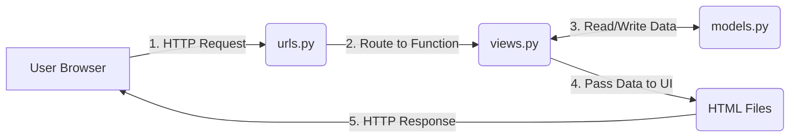

# Understanding Your EventPass CM Codebase

When we built EventPass CM, we used a framework called **Django**. Django follows a very specific architectural pattern known as **MVT (Model-View-Template)**. 

The core philosophy behind this structure is **Separation of Concerns**. By splitting the code into different files based on what it does (data vs. logic vs. visuals), the project remains organized, secure, and easy to scale even as it grows to thousands of lines of code.

Here is a breakdown of exactly how the application works, file by file.

---

## 1. The Big Picture: How a Request Works

When a user visits your website (e.g., clicking a link to register for an event), this is the journey their request takes through your files:

---

## 2. The Core Project Files (`eventpass/` folder)
This folder is the control center for your entire website.

### `eventpass/settings.py`
* **What it means:** This is the master configuration file for your project.
* **Importance:** It tells Django where your database is (`db.sqlite3`), what apps are installed (we added our `events` app here), and sets up security keys and timezones. 
* **Why this logic:** Centralizing settings means you don't have to hardcode database passwords or configurations across dozens of files. If you switch from SQLite to PostgreSQL later, you only change it in this one file.

### `eventpass/urls.py`
* **What it means:** The "Main Traffic Cop".
* **Importance:** When a user types a URL (like `yoursite.com/admin/`), this file looks at the URL and decides where to send it. 
* **Why this logic:** We told it to send anything starting with `/admin/` to the admin panel, and send *everything else* to our `events` app's local `urls.py` file.

---

## 3. The App Files (`events/` folder)
Django encourages you to break your project into "apps" (components). `events` is our main app handling ticketing.

### `events/models.py` (The Data)
* **What it means:** This file defines the structure of your database.
* **Importance:** Instead of writing complex SQL queries like `CREATE TABLE events (...)`, Django uses an **ORM (Object-Relational Mapper)**. You write standard Python classes (like `class Event:` and `class Registration:`). Django automatically translates these Python classes into a secure SQL database.
* **Why this logic:** 
  * It makes interacting with the database incredibly easy. To get all events, the code is just `Event.objects.all()`.
  * We linked `Registration` to `Event` using a `ForeignKey`. This tells the database: "Every ticket belongs to one specific event."

### `events/urls.py` (The Local Traffic Cop)
* **What it means:** Maps specific web addresses to specific logic functions.
* **Importance:** For example, it says: "If the user visits `/ticket/1234/`, run the `ticket_detail` function." 

### `events/views.py` (The Brain)
* **What it means:** This is where the actual programming logic lives. 
* **Importance:** Every function in this file takes a web `request` and must return a web `response`. 
* **Why this logic:**
  * In `event_register`, the logic checks: *Did they submit a form? Is the event full? If not, create a Registration in the database, generate a UUID, and redirect them to their ticket.*
  * In `ticket_qr`, the logic literally draws an image. It takes the unique UUID, builds a URL string, uses the `qrcode` library to draw pixels, and returns an image file directly to the browser instead of an HTML page.

### `events/admin.py` (The Organizer Dashboard)
* **What it means:** Configuration for Django's built-in admin panel.
* **Importance:** By simply registering our models here (`@admin.register(Event)`), Django automatically generated a fully functioning, secure dashboard where you can create, edit, and delete events.
* **Why this logic:** Keeping admin logic separated from the public `views.py` ensures that regular users can never accidentally access the dashboard logic.

---

## 4. The Visuals (`events/templates/events/`)
These are the HTML files the user actually sees.

### Why do they look weird? (Template Tags)
You'll notice tags like `` and `{{ event.title }}` inside the HTML. This is **Django's Templating Engine**. Standard HTML is static; it cannot change. These tags allow us to inject dynamic Python data (from `views.py`) directly into the HTML before it is sent to the user.

### `base.html`
* **What it is:** The master layout container. It includes the `<html>`, `<head>`, navigation bar, and loads the Tailwind CSS styling.
* **Why this logic:** **DRY (Don't Repeat Yourself)**. Instead of copying the navigation bar to every single page, `base.html` has a `` tag. All other pages "extend" `base.html` and just inject their unique content into that block.

### The other HTML files
* **`event_list.html`**: Uses a `` loop to generate a card for every event in the database automatically.
* **`event_register.html`**: A simple HTML `<form>`. When the user clicks submit, it sends a `POST` request back to `views.py`.
* **`ticket_detail.html`**: Displays the ticket. Notice the `` tag points to the `ticket_qr` URL, which executes the QR drawing logic in `views.py`.
* **`check_in_*.html`**: Different screens based on the `views.py` logic. If `is_checked_in` is false, it shows success. If true, it shows the red warning screen.

---

## 5. Other Important Files
* **`manage.py`**: A command-line tool that comes with Django. We use it to start the server (`runserver`), apply database changes (`migrate`), or create users (`createsuperuser`).
* **`db.sqlite3`**: The actual database file where your events and registrations are stored.
* **`venv/`**: The Virtual Environment. This is an isolated box where we installed Python packages (like Django and QR code generators) so they don't interfere with other software on your computer.
